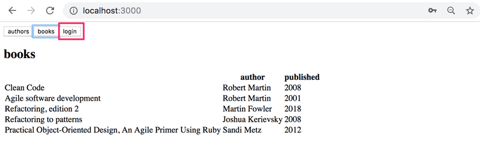
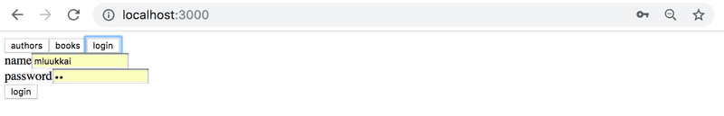
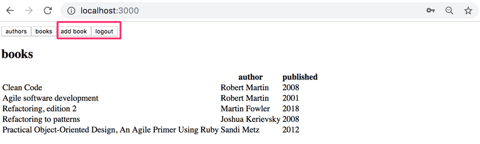
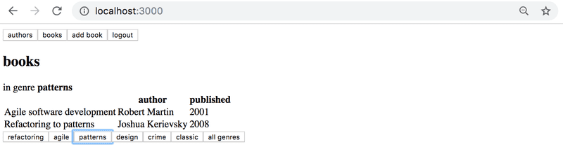
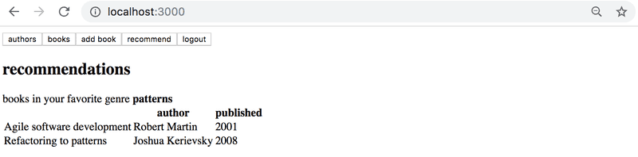

# Exercises

## Exercises 8.1.-8.7 : [library-backend](https://github.com/jokerinya/fsopen-part8/tree/main/library-backend)

> ## Exercises 8.8.-8.12.

Through these exercises, we'll implement a frontend for the GraphQL library.

Take [this project](https://github.com/fullstack-hy2020/library-frontend) as a start for your application.

You can implement your application either using the render prop components Query and Mutation of the Apollo Client, or using the hooks provided by Apollo client 3.0.

## 8.8: Authors view

Implement an Authors view to show the details of all authors on a page as follows:

## 8.9: Books view

Implement a Books view to show on a page all other details of all books except their genres.

## 8.10: Adding a book

Implement a possibility to add new books to your application. The functionality can look like this:

Make sure that the Authors and Books views are kept up to date after a new book is added.

In case of problems when making queries or mutations, check from the developer console what the server response is:

## 8.11: Authors birth year

Implement a possibility to set authors birth year. You can create a new view for setting the birth year, or place it on the Authors view:

## 8.12: Authors birth year advanced

Change the birth year form so that a birth year can be set only for an existing author. Use [select tag](https://reactjs.org/docs/forms.html#the-select-tag), [react select](https://github.com/JedWatson/react-select), or some other mechanism.

A solution using the react select library looks as follows:

## Exercises 8.13.-8.16 : [library-backend](https://github.com/jokerinya/fsopen-part8/tree/main/library-backend)

> ## Exercises 8.17.-8.22.

## 8.17 Listing books

After the backend changes, the list of books does not work anymore. Fix it.

## 8.18 Log in

Adding new books and changing the birth year of an author do not work because they require a user to be logged in.

Implement login functionality and fix the mutations.

It is not necessary yet to handle validation errors.

You can decide how the login looks on the user interface. One possible solution is to make the login form into a separate view which can be accessed through a navigation menu:

The login form:

When a user is logged in, the navigation changes to show the functionalities which can only be done by a logged-in user:

## 8.19 Books by genre, part 1

Complete your application to filter the book list by genre. Your solution might look something like this:

In this exercise, the filtering can be done using just React.

## 8.20 Books by genre, part 2

Implement a view which shows all the books based on the logged-in user's favourite genre.

## 8.21 books by genre with GraphQL

In the previous two exercises, the filtering could have been done using just React. To complete this exercise, you should redo the filtering the books based on a selected genre (that was done in exercise 8.19) using a GraphQL query to the server. If you already did so then you do not have to do anything.

This and the next exercises are quite **challenging** like it should be this late in the course. You might want to complete first the easier ones in the [next part](https://fullstackopen.com/en/part8/fragments_and_subscriptions).

## 8.22 Up-to-date cache and book recommendations

If you did the previous exercise, that is, fetch the books in a genre with GraphQL, ensure somehow that the books view is kept up to date. So when a new book is added, the books view is updated at least when a genre selection button is pressed.

_When new genre selection is not done, the view does not have to be updated._

## Exercises 8.23 : [library-backend](https://github.com/jokerinya/fsopen-part8/tree/main/library-backend)

## 8.24: Subscriptions - client, part 1

Start using subscriptions in the client, and subscribe to `bookAdded`. When new books are added, notify the user. Any method works. For example, you can use the `window.alert` function.
