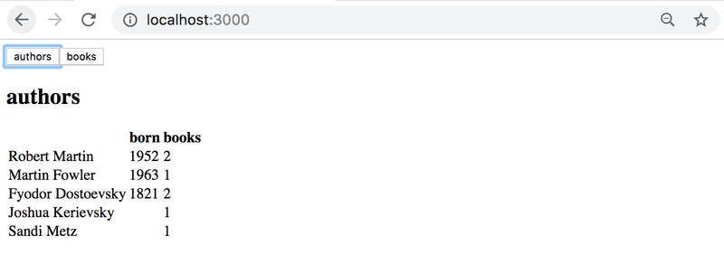

# Exercises

## Exercises 8.1.-8.7 : [library-backend](https://github.com/jokerinya/fsopen-part8/tree/main/library-backend)

> ## Exercises 8.8.-8.12.

Through these exercises, we'll implement a frontend for the GraphQL library.

Take [this project](https://github.com/fullstack-hy2020/library-frontend) as a start for your application.

You can implement your application either using the render prop components Query and Mutation of the Apollo Client, or using the hooks provided by Apollo client 3.0.

## 8.8: Authors view

Implement an Authors view to show the details of all authors on a page as follows:

